# Current Page States (With Screenshots)

This document captures the current state of the website pages using full-page screenshots taken from the local dev server (`http://localhost:3000`).

## Public Pages

### Home (`/`)

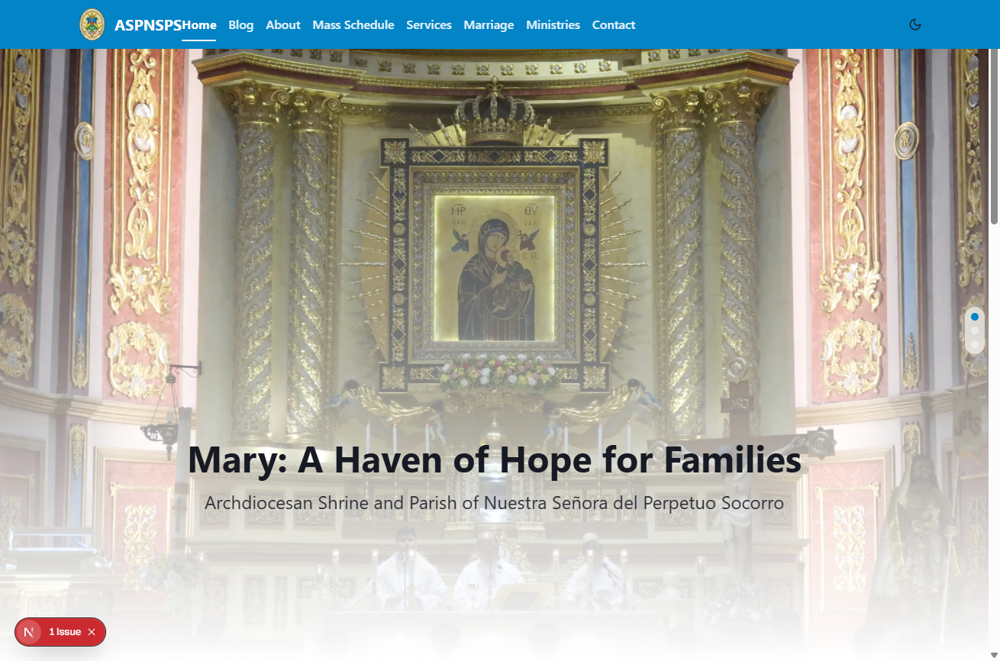

### About (`/about`)

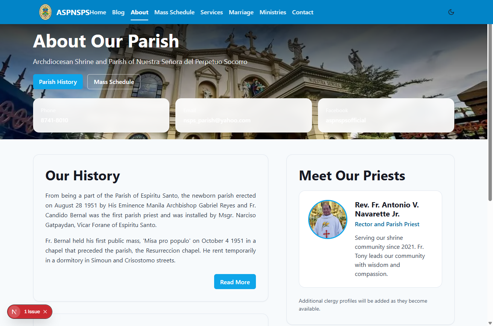

### Parish History (`/about/history`)

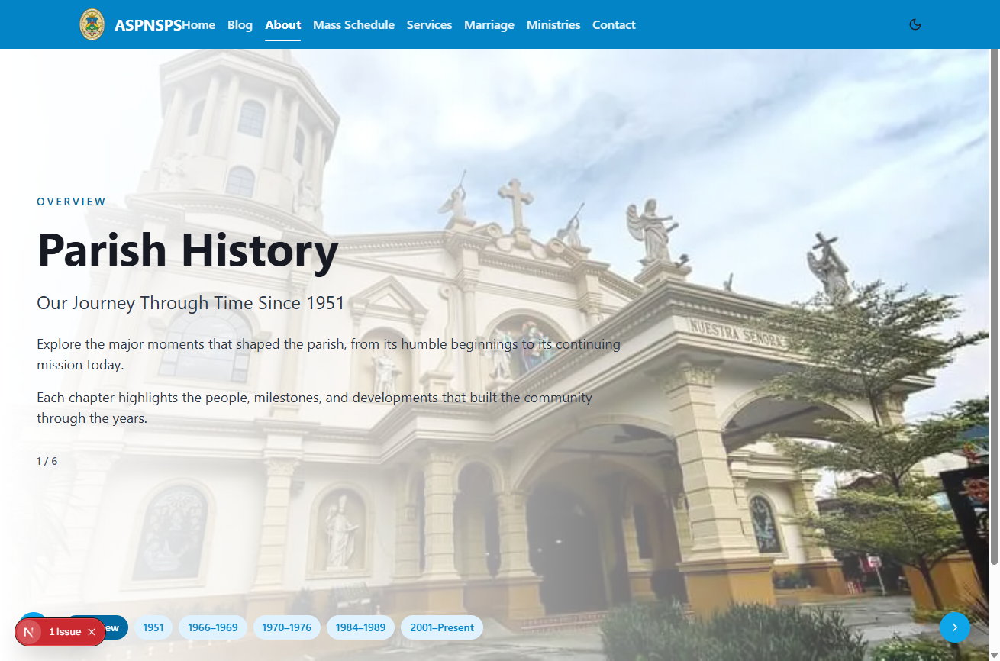

### Mass Schedule (`/schedule`)

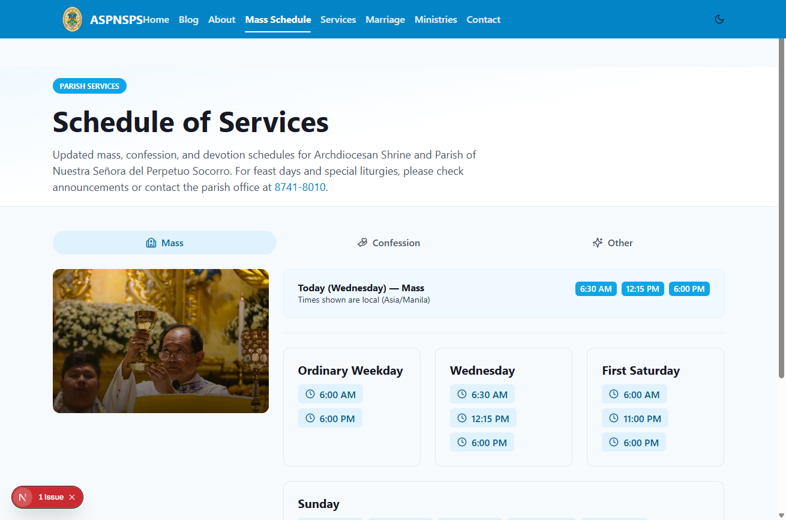

### Services (`/services`)

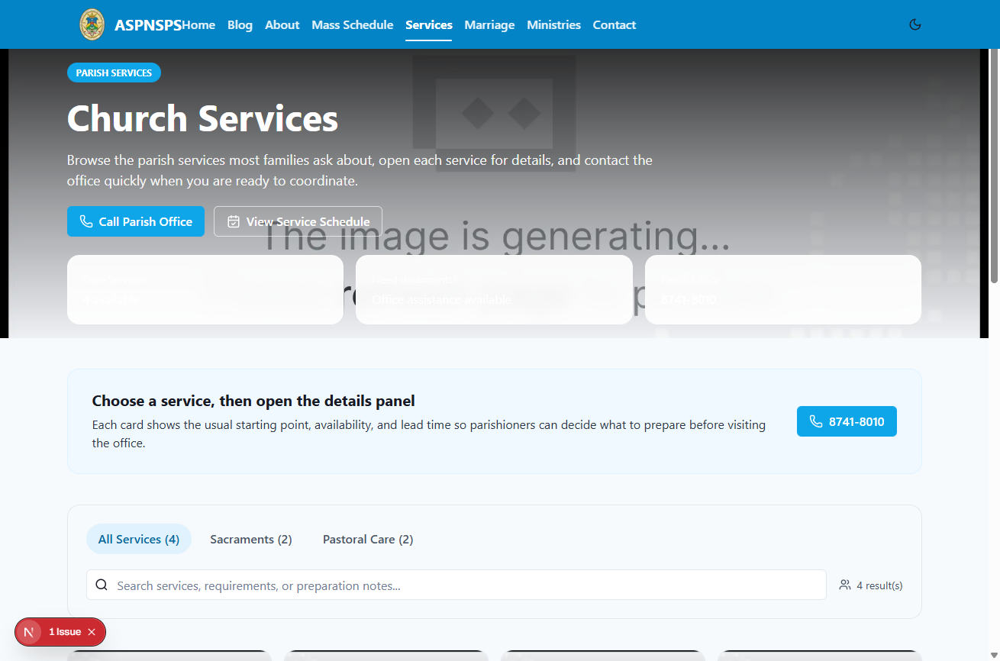

### Marriage (`/marriage`)

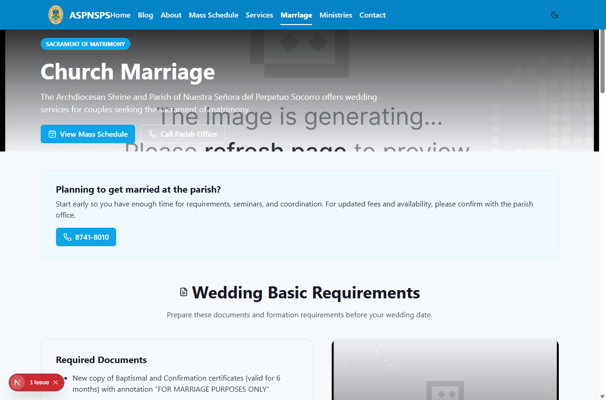

### Ministries (`/ministries`)

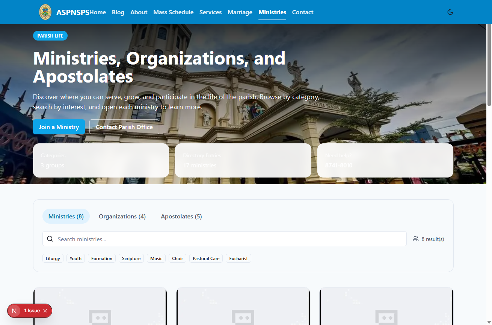

### Contact (`/contact`)

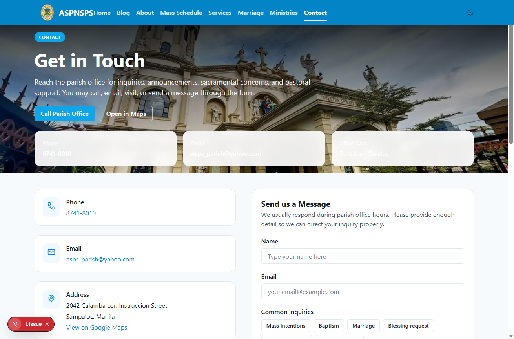

## Blog Pages

### Blog Index (`/blog`)

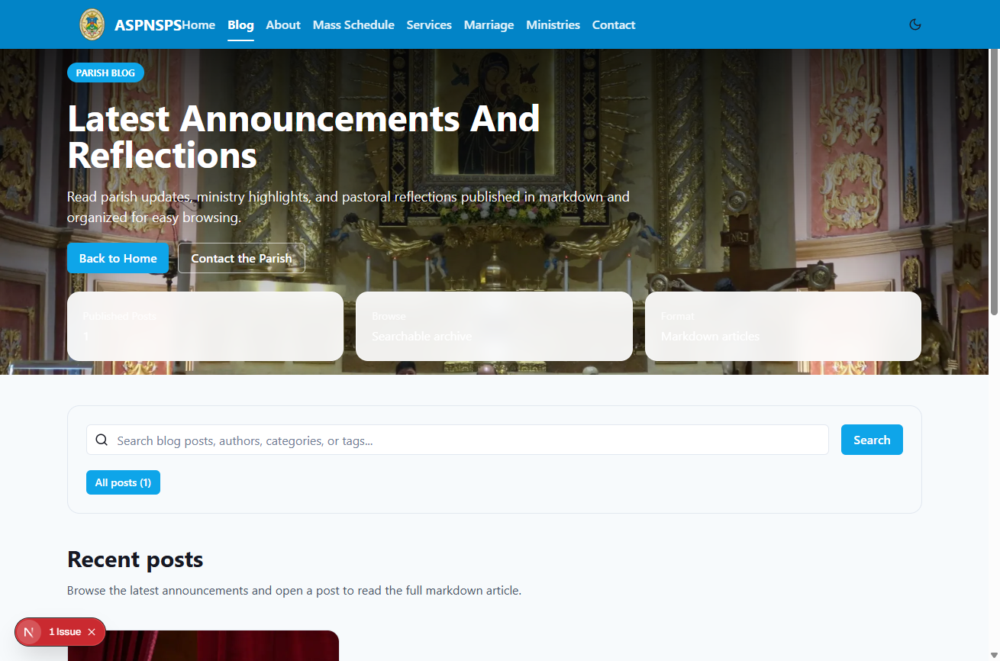

### Blog Post Example (`/blog/pope-leo-xiv-election`)

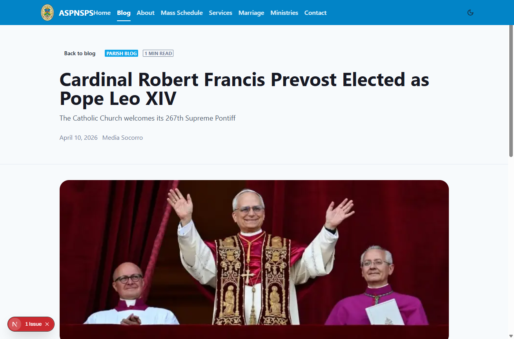

### Blog Not Found State (`/blog/non-existent-slug`)

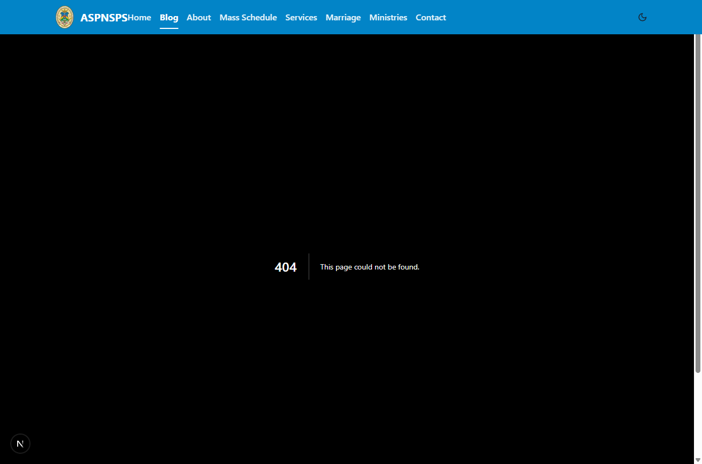

